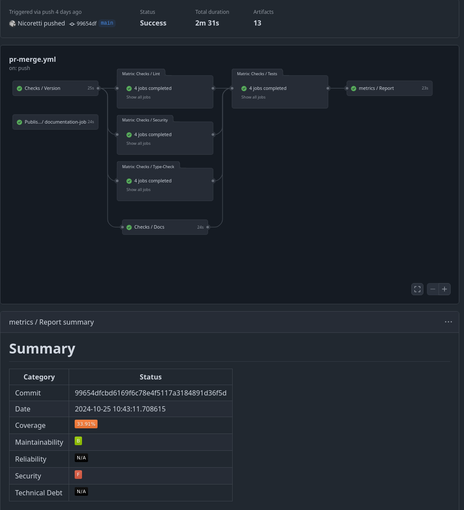
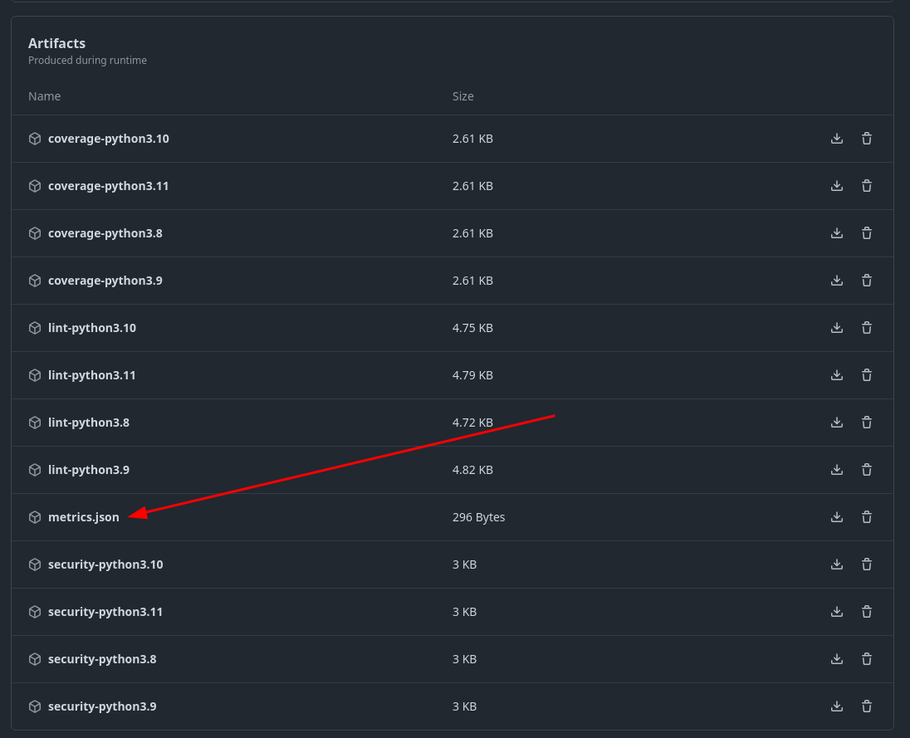

.. _metrics:

:octicon:`graph` Metrics
========================

To establish a unified approach for metrics and reporting across our projects, we have developed a simple and straightforward metrics schema, see: `Exasol Schemas`_  (Section: *Exasol Project Metrics*).
This schema is designed for ease of use and can be adopted universally across our projects for reporting fundamental metric data.

Why a Custom Format?
--------------------

#. **Simplicity and Clarity**:

   - The schema is straightforward, making it easy to understand and implement.
  
#. **Vendor Neutrality and Extensibility**:

   - It is not tied to any specific vendor, allowing us to customize and extend it as needed.
  
#. **Ease of Integration**:

   - Existing tools and vendor solutions can be seamlessly integrated by creating mappings from vendor results to our metrics schema.

#. **Customizable Metrics Generation and Evaluation**:

   - We have the flexibility to adjust how metric data is generated and evaluated based on our specific needs. This, for example, allows us the freedom to rate maintainability differently across various language ecosystems, avoiding lock-in to a single method.

Schema
------

see also `Exasol Schemas`_.

Examples
________

**0.1.0**

.. code-block:: json

   {
      "commit": "99654dfcbd6169f6c78e4f5117a3184891d36f5d",
      "date": "2024-10-25 10:43:10.145235",
      "coverage": 33.910533910533914,
      "maintainability": "B",
      "reliability": "N/A",
      "security": "F",
      "technical_debt": "N/A"
   }

**0.2.0**

.. code-block:: json

   {
      "project": "python-toolbox",
      "commit": "99654dfcbd6169f6c78e4f5117a3184891d36f5d",
      "date": "2024-10-25 10:43:10.145235",
      "coverage": 33.910533910533914,
      "maintainability": "B",
      "reliability": "N/A",
      "security": "F",
      "technical_debt": "N/A"
   }

Workflows
---------

As some may already know, the Python toolbox comes with various tools to help maintain our Python projects. One of these tools is the workflow templates, which can be generated and updated by default. The toolbox also provides a workflow called *report*, which gathers and reports a metrics summary for the project's CI run. For details on the workflow, run :code:`tbx workflow show report` to see the full workflow definitions. Below, you can see two screenshots of the results and artifacts this workflow provides.

Tooling
-------

Projects
________

Projects can run the nox task :code:`nox -s report` to generate their project metrics if they are using the :code:`exasol-toolbox`.

Development
___________

If the metrics schema needs to be updated, the `Metrics Schema Project`_ provides a convenient way (Pydantic model-based) to update and generate an updated schema for the metrics.

.. note::

   The updated version needs to be integrated into the `Exasol Schemas Project`_.

Ratings
-------
The strategy on how the rating of the Python code and projects work can be seen in the `metrics.py`_ file.

Collection
----------
For our open-source projects, there is a scheduled job that regularly collects metrics information from projects. This data is then aggregated and added to a central data store. For more details, please refer to the crawler project documentation.

Links & References
------------------
* `Exasol Schemas`_
* `Metrics Schema`_
* `Metrics Schema Project`_
* `metrics.py`_

.. _Exasol Schemas: https://schemas.exasol.com
.. _Exasol Schemas Project: https://github.com/exasol/schemas
.. _Metrics Schema: https://schemas.exasol.com/project-metrics-0.2.0.html
.. _metrics.py: https://github.com/exasol/python-toolbox/blob/main/exasol/toolbox/metrics.py
.. _Metrics Schema Project: https://github.com/exasol/python-toolbox/tree/main/metrics-schema 

