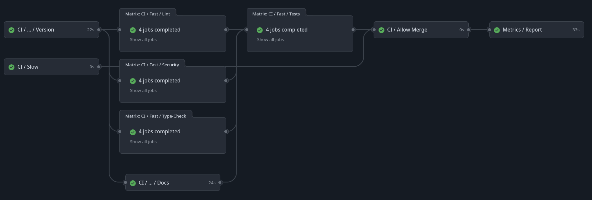

.. _GitHub Workflows:

GitHub Workflows
================

.. toctree::
    :maxdepth: 2
    :hidden:

    configuration

The exasol-toolbox ships with various GitHub workflow templates. To leverage the full feature set of the toolbox, you should use them.

.. attention::

   Generally, it is advised to install/use all workflows provided by the toolbox as a whole due to their interdependencies.

   However, if you know what you are doing and are well-versed in GitHub workflows and actions, you can use just select individual ones or use them as inspiration. Still, an individual approach is likely to be more error-prone.

.. note::

    The toolbox command itself, :code:`tbx`, provides various CLI functions to help you maintain those workflows.
    For further help, run the command :code:`tbx workflow --help`.
