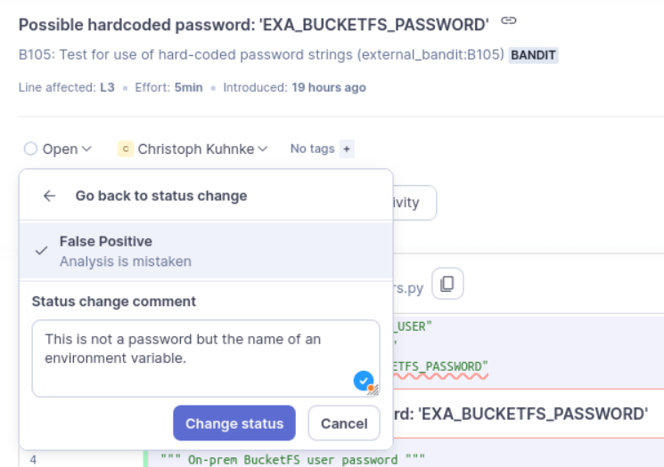

.. _ignore_findings:

How to Ignore Sonar Findings?
=============================

In rare cases, Sonar might report a finding, you cannot fix or on which you
can agree with your reviewers to accept or ignore it.  Please only choose this
approach as a last resort.

As Sonar reports only findings generated by other tools there are often
multiple IDs you can use for referring to a particular issue.  E.g. security
findings can be reported by ``bandit`` and hence for such a finding there is a
bandit ID as well as a Sonar ID.

Example
-------

For ``subprocess.run(args)``, Sonar could for example report *subprocess
call - check for execution of untrusted input*. In the Sonar UI, when clicking
on "Why is this an issue?", you will find references like

* *B603: Test for use of subprocess with shell equals true
  external_bandit:B603*
* *See description of Bandit rule B603 at the*
  `Bandit <https://bandit.readthedocs.io/en/latest/plugins/b603_subprocess_without_shell_equals_true.html>`__
  *website*.

In this case, the bandit error code is ``B603``, which you can either accept
via Sonar UI or ignore via a comment in the source code.

Ignoring a Finding Via a Source Code Comment
--------------------------------------------

The recommended way of ignoring such a finding, is to append a comment to the
relevant line of code:

.. code-block:: python

    subprocess.run(args)  # nosec: B603 - risk of untrusted input is accepted

Alternatively, you could also accept a finding in the Sonar UI:

