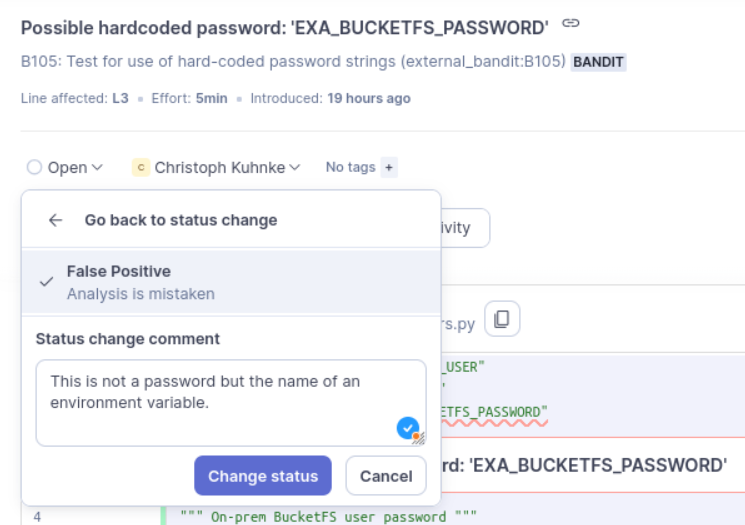

.. _ignore_findings:

Ignoring Sonar Findings
=======================

In rare cases, Sonar might report a finding that you cannot fix immediately or
that reviewers agree to accept. Please only choose this approach as a last
resort.

Remember that Sonar often displays findings originating from another tool. That
means a single issue can have both a Sonar identifier and a tool-specific
identifier. For example, security findings reported by ``bandit`` can usually
be referred to by their Bandit rule code as well.

Example
-------

For ``subprocess.run(args)``, Sonar could for example report *subprocess
call - check for execution of untrusted input*. In the Sonar UI, when clicking
on "Why is this an issue?", you will find references like

* *B603: Test for use of subprocess with shell equals true
  external_bandit:B603*
* *See description of Bandit rule B603 at the*
  `Bandit <https://bandit.readthedocs.io/en/latest/plugins/b603_subprocess_without_shell_equals_true.html>`__
  *website*.

In this case, the Bandit error code is ``B603``. When possible, prefer handling
the finding at the source-tool level so that the reason is documented in code.

Ignoring a Finding Via a Source Code Comment
--------------------------------------------

If the originating tool supports it, the recommended way of ignoring a finding
is to add an explicit source code comment on the affected line:

.. code-block:: python

    subprocess.run(args)  # nosec: B603 - risk of untrusted input is accepted

The keyword ``nosec`` is defined by `Bandit <bandit_exclusions_>`_ in this case.

.. _bandit_exclusions: https://bandit.readthedocs.io/en/latest/config.html#exclusions

Alternatively, you could also accept a finding in the Sonar UI:

