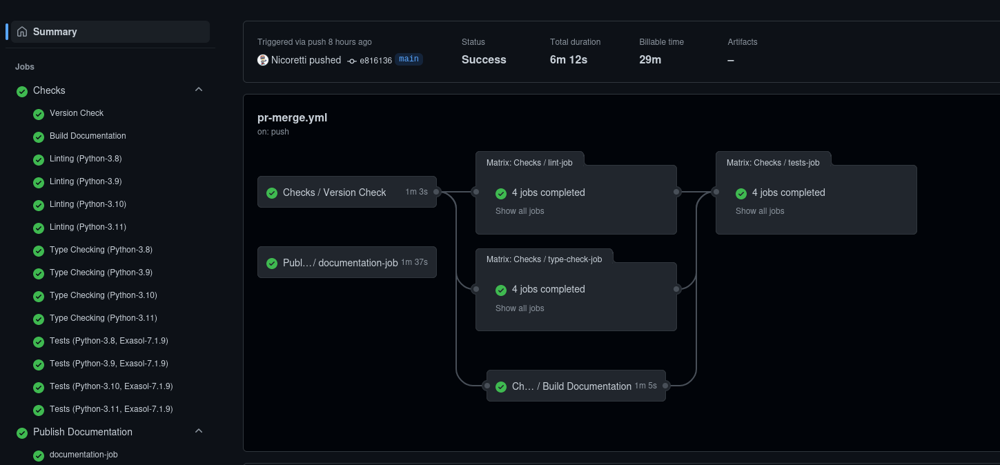

🏗️ Workflows (CI/CD)
====================

Generate CI & CI/CD workflows
-----------------------------

The exasol-toolbox simplifies and supports 3 easily maintainable workflows.
in order to make them work follow the description bellow.

**Workflows**:

* CI
    Verifies PR's and regularly checks the project.

* CI/CD
    Verifies and publishes releases of the project.

* PR-Merge
    Validates merges  and updates the documentation.

0. Determine the toolbox version
++++++++++++++++++++++++++++++++
One of the snippets bellow, should do the trick:

#.

    .. code-block:: shell

        poetry show exasol-toolbox

#.

    .. code-block:: python

        python -c "from exasol.toolbox.version import VERSION;print(VERSION)"

1. Configure your project
++++++++++++++++++++++++++
Make sure your github project has access to a deployment token for PyPi with the following name:  **PYPI_TOKEN**.
It should be available to the repository either as Organization-, Repository- or Environment- secret.

2. Add the standard workflows to your project
+++++++++++++++++++++++++++++++++++++++++++++

.. warning::

    When you use the configurations bellow you should replace *@main* *ref* with a *ref* which is pointing
    to the toolbox version you are using. E.g. if you are using toolbox version *0.1.0* replace
    all references to *@main* with references to *@0.1.0*.

CI Workflow
___________

To enable this workflow, add a file with the name *ci.yml* in your *.github/workflows* folder
and add the following content:

.. literalinclude:: ../../.github/workflows/ci.yml
    :language: yaml

CI/CD Workflow
______________

.. attention::

    Requires PYPI token to be available

To enable this workflow, add a file with the name *ci-cd.yml* in your *.github/workflows* folder
and add the following content:

.. literalinclude:: ../../.github/workflows/ci-cd.yml
    :language: yaml

PR-Merge Workflow
_________________

To enable this workflow, add a file with the name *pr-merge.yml* in your *.github/workflows* folder
and add the following content:

.. literalinclude:: ../../.github/workflows/pr-merge.yml
    :language: yaml
