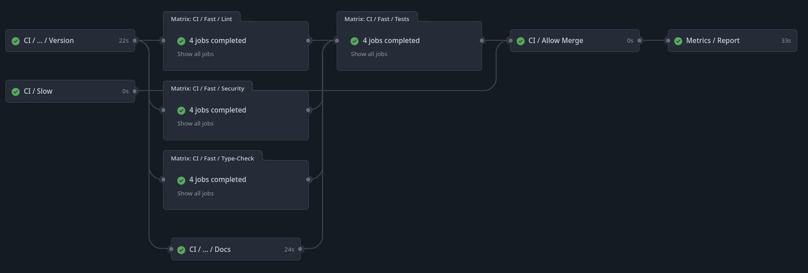

.. _GitHub Workflows:

GitHub Workflows
================

The exasol-toolbox ships with various GitHub workflow templates. To leverage the full feature set of the toolbox, you should use them.

.. attention::

   Generally, it is advised to install/use all workflows provided by the toolbox as a whole due to their interdependencies.

   However, if you know what you are doing and are well-versed in GitHub workflows and actions, you can use just select individual ones or use them as inspiration. Still, an individual approach is likely to be more error-prone.

.. note::

    The toolbox command itself, :code:`tbx`, provides various CLI functions to help you maintain those workflows.
    For further help, run the command :code:`tbx workflow --help`.

1. Configure the GitHub project
+++++++++++++++++++++++++++++++

* Make sure your GitHub project has access to a deployment token for PyPi with the following name: **PYPI_TOKEN**. It should be available to the repository either as an Organization-, Repository-, or Environment-secret.

* If your CI workflow involves slow or expensive steps you can guard these to be executed only after manual approval. The CI workflow will automaticall create a GitHub environment named :code:`manual-approval`. You only need to add reviewers in (:code:`Settings/Environments/manual-approval`) and move the steps to be guarded into the related section in job :code:`slow-checks` in file :code:`.github/workflows/merge-gate.yml`.

2. Add all workflows to your project
++++++++++++++++++++++++++++++++++++

.. code-block:: shell

    tbx workflow install all

.. warning::

    #. If you already have various workflows, you may want to run the :code:`update` command instead of the :code:`install` command.

    #. Some workflows depend on other workflows. Please ensure you have all the required workflows if you do not install all of them.

3. Update Branch Protection
++++++++++++++++++++++++++++

The best and most maintainable way to have solid branch protection (:code:`Settings/Branches/main`) is to require the workflow :code:`CI / Allow Merge` to pass successfully.
